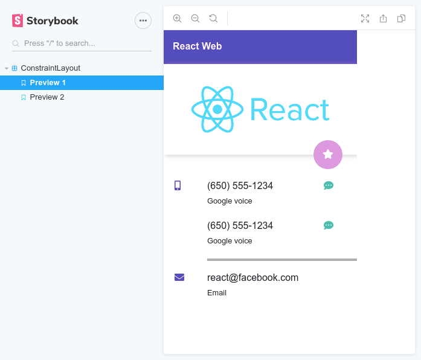

# react-constraint-layout

react-constraint-layout is a Javascript library that provides a constraint based solution to position HTML elements relative to each other and to the parent **with zero CSS**.

You can support the project by starring it on Github. Click [here](https://github.com/kwameopareasiedu/react-constraint-layout) to visit the projects Github page

If you like this project, you can support it by becoming a patreon [here](https://www.patreon.com/kwameopareasiedu)

### Install

`npm install --save-dev react-constraint-layout` or `npm i -D react-constraint-layout`

### Screenshots

No, those screenshots **are not** Android. That's React, and the best part; they were done with **zero CSS** (No Bootstrap, No Flexbox, No CSS grid)

### API

The library exports three UI components which form the core of the framework:

1. `ConstraintLayout`
2. `ConstrainedView`
3. `ConstraintGuide`

##### ConstraintLayout

This component is the root component that positions its children relative to each other.
It supports the following props:

| Prop     | Type                                       | Description                                                                                                                                     |
| -------- | ------------------------------------------ | ----------------------------------------------------------------------------------------------------------------------------------------------- |
| `width`  | `string` or `number` (E.g. _20px_ or _20_) | The width of the component. Not specifying will default to the full width of its parent                                                         |
| `height` | `string` or `number` (E.g. _50px_ or _50_) | The height of the component. Since children are absolutely positioned, the height cannot be automatically estimated. Hence this is **required** |

> The `<ConstraintLayout/>` only supports `<ConstrainedView/>`, `<ConstraintGuide/>` and `<ConstraintLayout/>` as its **direct** children.

##### ConstrainedView

This component is a direct child of the `<ConstraintLayout/>`. This components provides constraint-related props for the positioning of itself relative to sibling views.

| Prop               | Type                                       | Description                                                                                                                                                     |
| ------------------ | :----------------------------------------- | --------------------------------------------------------------------------------------------------------------------------------------------------------------- |
| `id`               | `string`                                   | The identifier for the component. This is necessary if other views will be constrained to it.                                                                   |
| `as`               | `string` or `Function`                     | This allows you to specify a tag name for the `<Constrained />` view. You can also specify another component to be rendered (More on this). Defaults to **div** |
| `width`            | `string` or `number` (E.g. _20px_ or _20_) | The width of the component. Not specifying will default to _0px_. A zero-width component's width will only be controlled by the horizontal constraints (if any) |
| `height`           | `string` or `number` (E.g. _50px_ or _50_) | The height of the component. Not specifying will default to _0px_. A zero-height component's width will only be controlled by the vertical constraints (if any) |
| `leftToLeftOf`     | `string` or `Array`                        | Indicates that the left of this component is aligned to the left of another component specified by this id                                                      |
| `leftToRightOf`    | `string` or `Array`                        | Indicates that the left of this component is aligned to the right of another component specified by this id                                                     |
| `rightToRightOf`   | `string` or `Array`                        | Indicates that the right of this component is aligned to the right of another component specified by this id                                                    |
| `rightToLeftOf`    | `string` or `Array`                        | Indicates that the right of this component is aligned to the left of another component specified by this id                                                     |
| `topToTopOf`       | `string` or `Array`                        | Indicates that the top of this component is aligned to the top of another component specified by this id                                                        |
| `topToBottomOf`    | `string` or `Array`                        | Indicates that the top of this component is aligned to the bottom of another component specified by this id                                                     |
| `bottomToBottomOf` | `string` or `Array`                        | Indicates that the bottom of this component is aligned to the bottom of another component specified by this id                                                  |
| `bottomToTopOf`    | `string` or `Array`                        | Indicates that the bottom of this component is aligned to the top of another component specified by this id                                                     |
| `horizontalBias`   | `number` (0 to 1)                          | The bias used to shift the component along its constraint axis if it is fully horizontally constrained                                                          |
| `verticalBias`     | `number` (0 to 1)                          | The bias used to shift the component along its constraint axis if it is fully vertically constrained                                                            |

> Since the props are merged, you can add any React HTML attribute (E.g. style, onClick, etc.) directly to the `<ConstrainedView />`
> component and the framework will render them on the DOM element itself.

> The value of a constraint prop (I.e. `leftToLeftOf`, `leftToRightOf`, etc.) can be set to **\_parent** to align with the parent.
> As an example, we can use `leftToLeftOf="_parent"` to align the left of a component to the left of it's `<ConstraintLayout/>` parent.

> If an array of ids is passed to any of the constraint props (I.e. `leftToLeftOf`, `leftToRightOf`, etc.), the solver will search the children with each array element and select the one which first matches a child.
> This is useful if some children are conditionally rendered. If none of the ids match any of the children, the parent reference is used for that prop

> All the props of `<ConstrainedView />` can be used with `<ConstraintLayout />` because nesting of `<ConstraintLayout />` is also supported

##### ConstraintGuide

This is a non-visual component that serves as a guide for other `<ConstrainedView />` components to align with. For example, if you want a `<ConstrainedView />` to be aligned at 20% from the left of the parent view, you would create a `<ConstraintGuide />` and set its percent to _20%_.
The best way to think of this component is as an invisible ruler within the `<ConstraintLayout />`.

It supports the following props:

| Prop          | Type                                       | Description                                                                                                                                                            |
| ------------- | ------------------------------------------ | ---------------------------------------------------------------------------------------------------------------------------------------------------------------------- |
| `id`          | `string`                                   | The identifier for the guide. This is necessary if other views will be constrained to it.                                                                              |
| `orientation` | `string` Can be `vertical` or `horizontal` | Sets the orientation of the guide                                                                                                                                      |
| `begin`       | `string` or `number`                       | The starting point of the guideline in **px**. If `orientation` is `horizontal`, it will be that **number of pixels** from the **left** of the `<ConstraintLayout />`  |
| `end`         | `string` or `number`                       | The starting point of the guideline in **px**. If `orientation` is `horizontal`, it will be that **number of pixels** from the **right** of the `<ConstraintLayout />` |
| `percent`     | `number`                                   | The starting point of the guideline in **%**. If `orientation` is `horizontal`, it will be that **percentage** of the `<ConstraintLayout />` width from the left       |

### Examples

The [examples](https://github.com/kwameopareasiedu/react-constraint-layout/blob/master/examples/EXAMPLES.md) folder contains code samples for the two user interfaces showcased in the screenshots.

### Maintainers

-   [Kwame Opare Asiedu](https://github.com/kwameopareasiedu/)

### Contributing

If you'd like to contribute to the project development, you can do so by:

1. Clone the project from [here](https://github.com/kwameopareasiedu/react-constraint-layout)
2. Start storybook server by using `npm run storybook`
3. Add features to project
4. Create a PR on the project

I'll then review the pull request and if all checks out, it'll be merged to the master branch and you'll be added to the list of maintainers

### Support

If you'd like to support this project, you can do so by becoming a patreon on [Patreon](https://www.patreon.com/kwameopareasiedu)

It would be really helpful if you can star the project on [Github](https://github.com/kwameopareasiedu/react-constraint-layout)

### Licence

[MIT](https://github.com/kwameopareasiedu/react-constraint-layout/blob/master/LICENCE.md) (c) Kwame Opare Asiedu

### Changelog

-   1.0.2
    -   Fixed solver update on window resize feature in `<ConstraintLayout />` component
    -   Added `useWindowBreakpoints` hook. Handy for conditional rendering at different window breakpoints
    -   Added optional types to props
    -   Fixed rollup configuration issue causing watch mode to fail after first trigger in development mode
-   1.0.1
    -   Fixed issue [#1](https://github.com/kwameopareasiedu/react-constraint-layout/issues/1)
-   1.0.0
    -   Initial release
