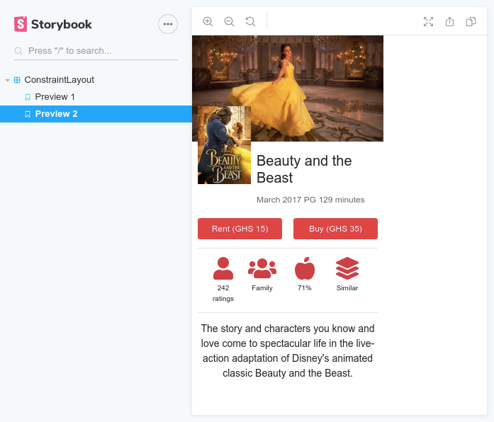

# Examples

There are two awesome user interfaces recreated from their original android constraint-layout.

### Preview 1

The first screenshot is of the android original and the second is the recreated layout using `<ConstraintLayout />`.

[View source code](./preview1/index.jsx)

[View storybook sample](https://kwameopareasiedu.github.io/react-constraint-layout/?path=/story/constraintlayout--preview-1)

---

### Preview 2

The first screenshot is of the android original and the second is the recreated layout using `<ConstraintLayout />`.

[View source code](./preview2/index.jsx)

[View storybook sample](https://kwameopareasiedu.github.io/react-constraint-layout/?path=/story/constraintlayout--preview-2)

